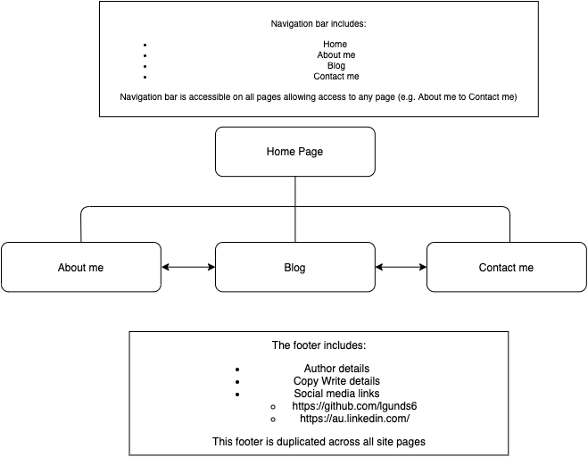
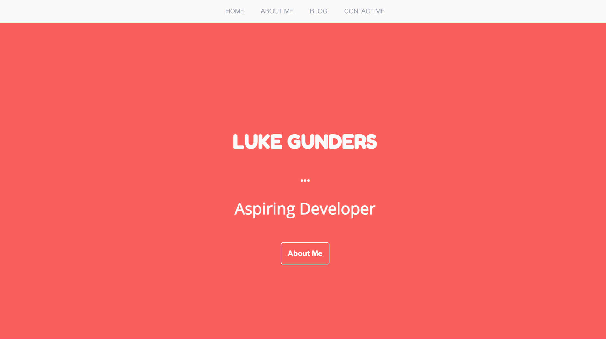
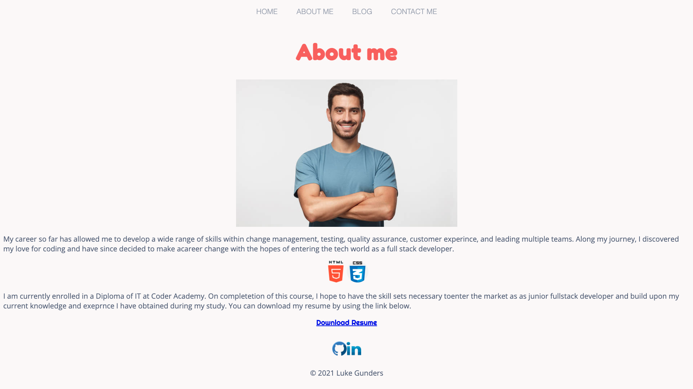
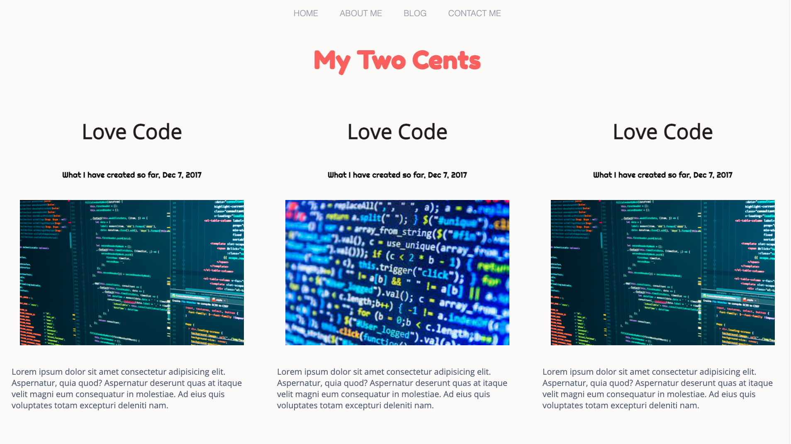
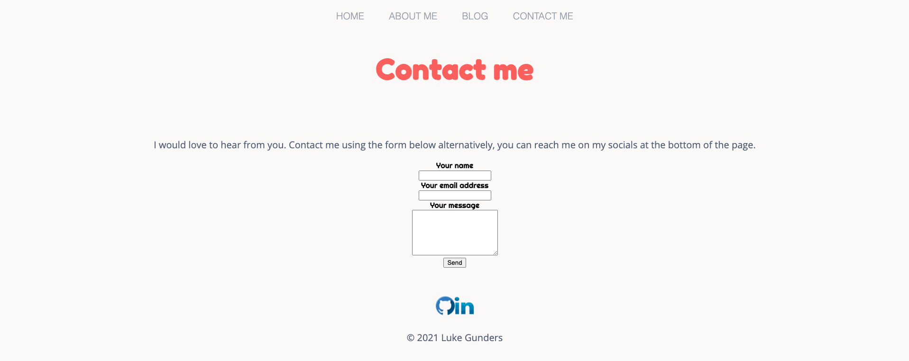

## Website
https://luke-gunders.netlify.app/

## Github Repository
https://github.com/lgunds6/Term1-portfolio

# My Portfolio Website

## Table of contents

- [Description:](#Description)
- [Purpose:](#Purpose)
- [Status:](#Status)
- [Functionality/features:](#Functionality/features)
- [Sitemap:](#Sitemap)
- [Screenshots:](#Screenshots)
- [Target-Audience:](#Target-Audience)
- [Tech-stack:](#Tech-stack)

## Description
This is my professional portfolio.

## Purpose
This website is my professional portfolio that will demonstrate my technical ability and be used to share with future employers.

## Status
In progress.

## Functionality/features
This website contains 4 separate HTML pages, Navigation Bar, and Footer:

- Home

Contains semantic HTML elements for accessibility and a button linked to About me page.

- About Me

Contains semantic HTML elements for accessibility and a download link to my resume.

- Blog

Contains semantic HTML elements for accessibility and five separate blog posts thatinclude images, titles, dates, and text.

- Contact Me

Contains semantic HTML elements for accessibility and a contact men form that allows a user to send me a message (max character length 3000).

- Navigation bar

The nav bar is displayed across all pages and allows access to any page from any one page.

- Footer

The footer is displayed across all pages with copy wwrite information and two links to socials.

## Sitemap

## Screenshots
#### Home

#### About me

#### Blog

#### Contact me

## Target Audience
This portfolio is targeted at potential employers and recruiters.

## Tech stack
Project created with:
- HTML 5
- CSS 3

##  Deployment platform
Netlify

